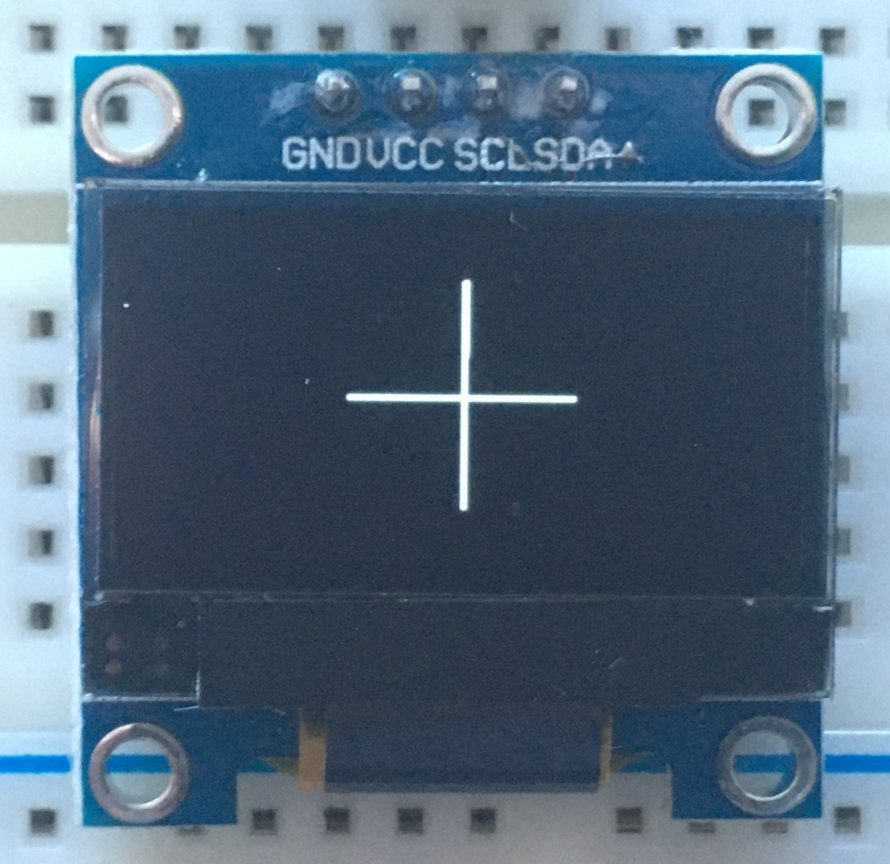
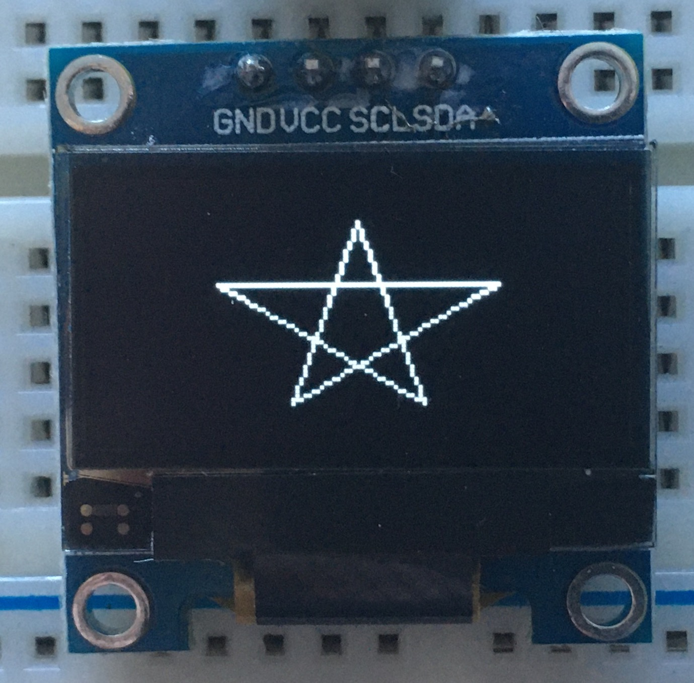
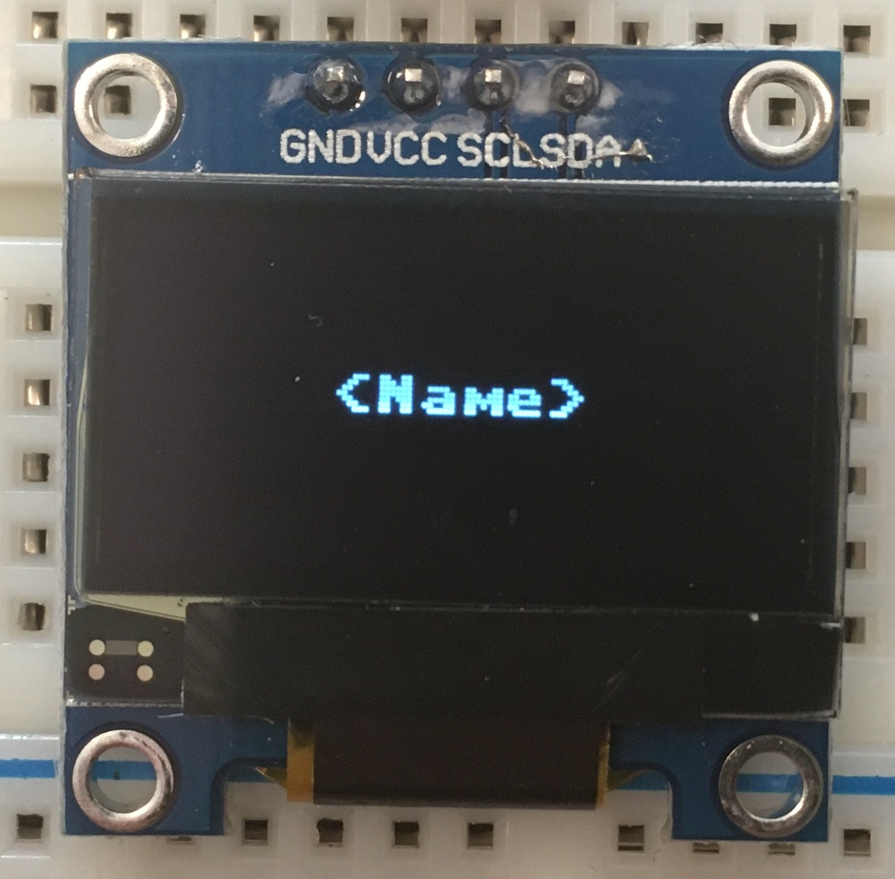
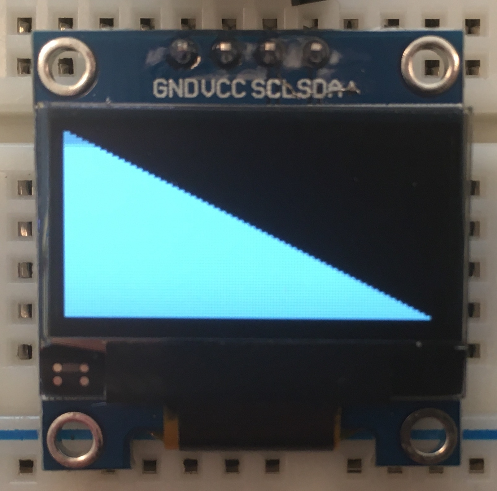
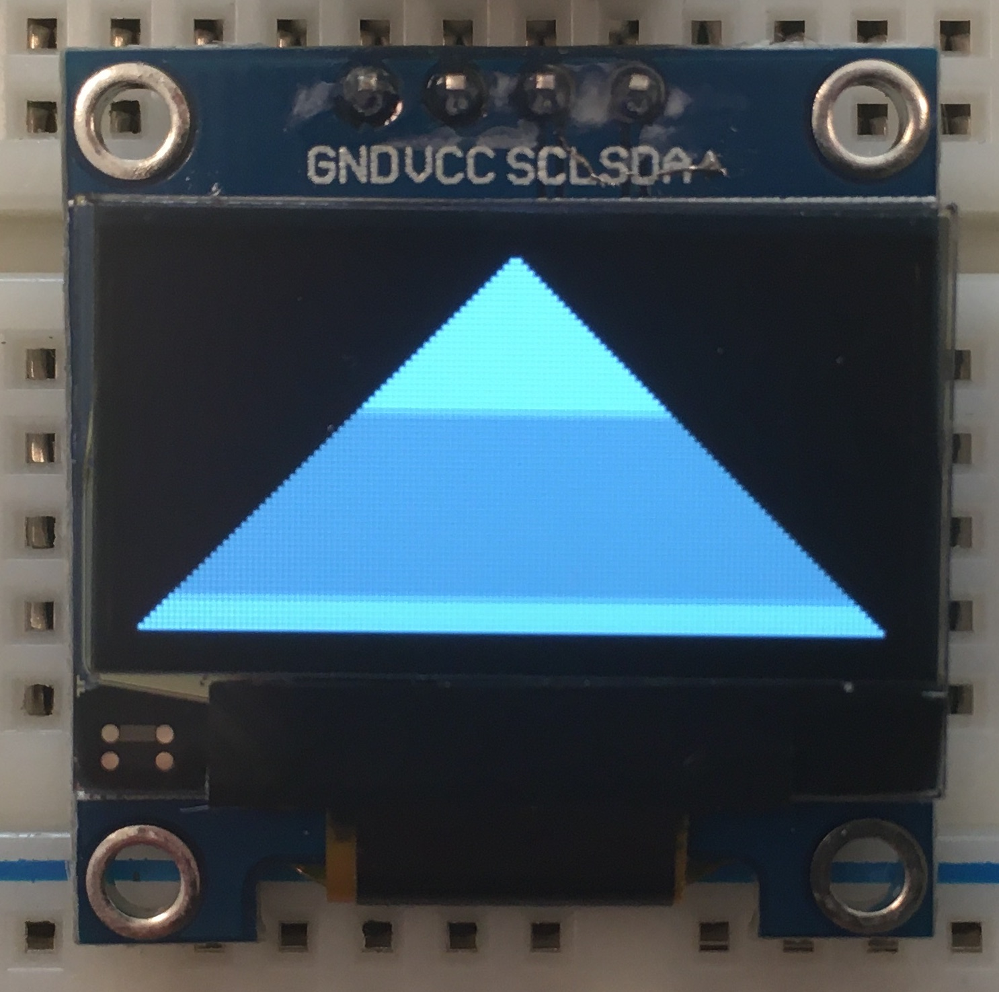
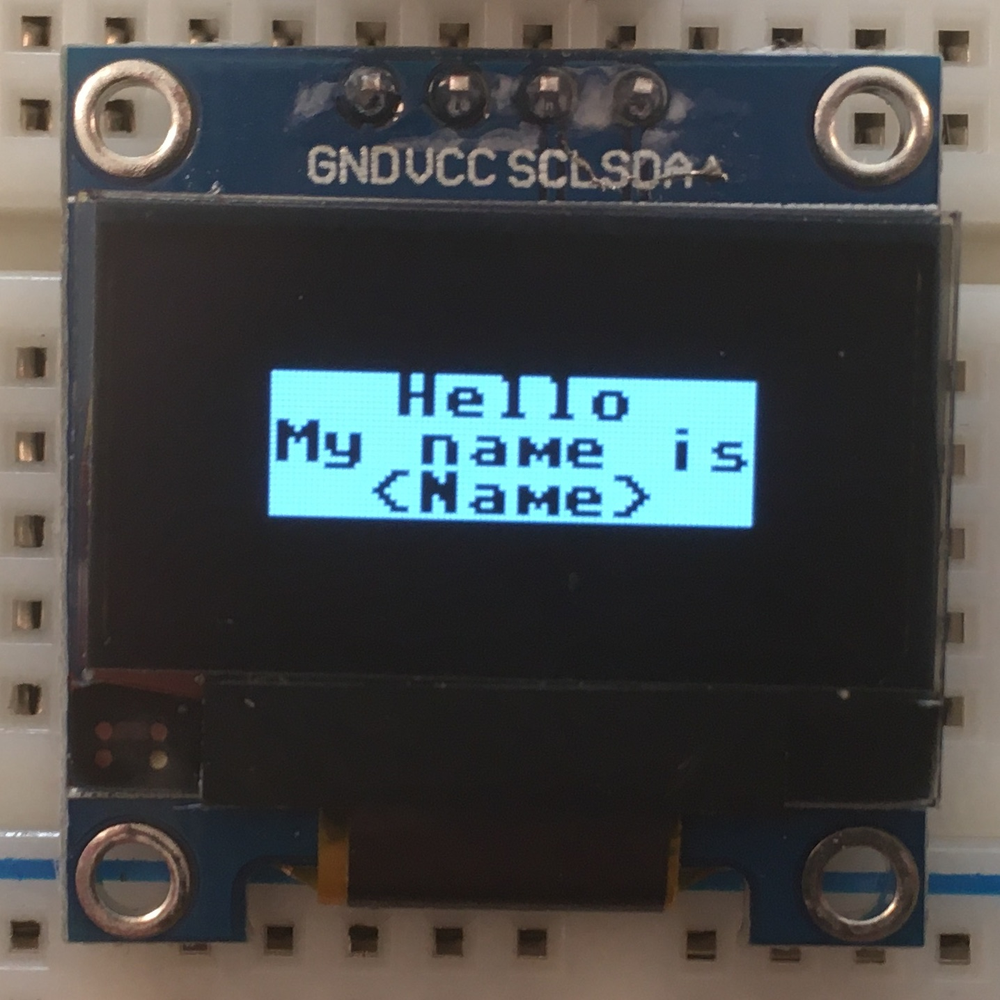
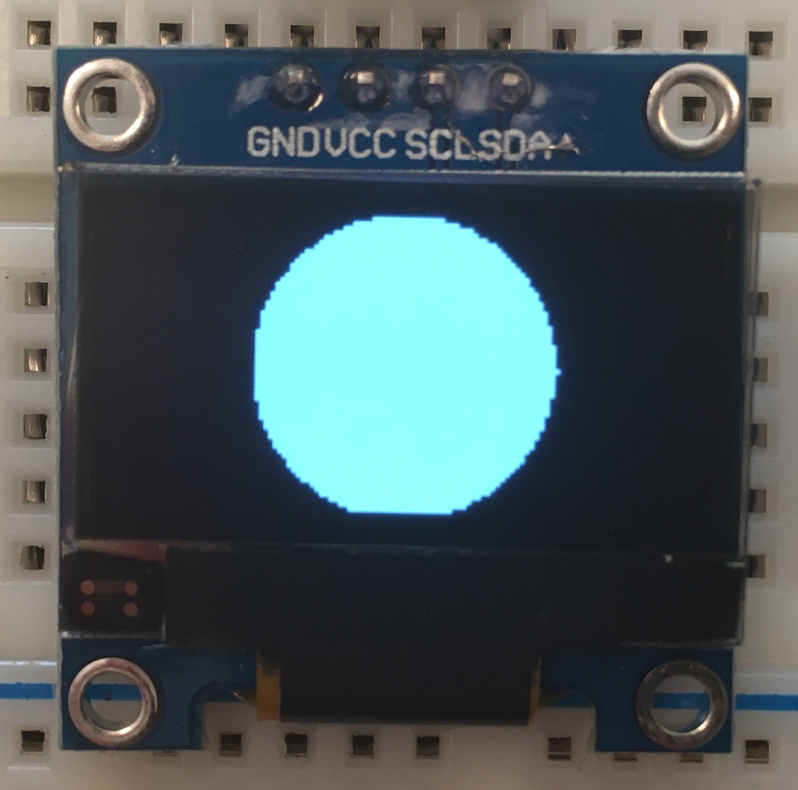

# OLED Screens

## Installation instructions

1. Open Thonny and go to `Tools` > `Manage Packages`.
(if this doesn't show up, ensure you have either 'Local Python 3' or your RP2040 interpreter selected in the bottom right).
2. Search for `ssd1306` and select `micropython-ssd1306`.
3. Click `Install` to download and install it.

## Exercises

### Plus

### Star

### Name

### Stripes

### Slope

### Triangle

### Name v2

### Circle

